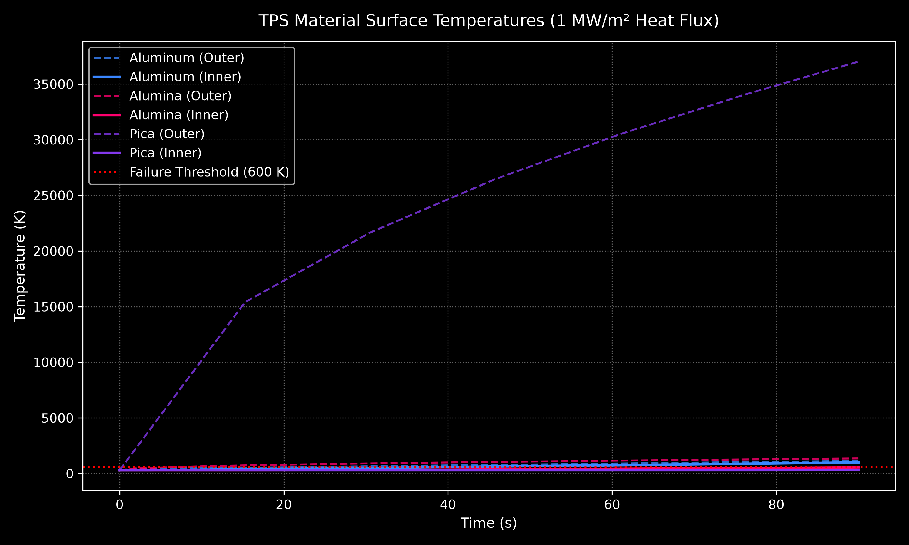

# 1D Thermal Protection System (TPS) Simulation

A 1D explicit finite difference solver for transient thermal conduction through atmospheric entry heat shield materials: Aluminum 6061-T6, Alumina Ceramic, and Phenolic-Impregnated Carbon Ablator (PICA).



*Y-axis capped at 2000 K for readability. PICA outer surface reaches ~37,000 K (physically correct — ultralow conductivity prevents heat from penetrating inward, which is the design intent). PICA inner surface remains at 306 K.*

---

## Overview

This project models heat propagation across a 1D spatial domain subject to high aerodynamic thermal flux (1.0 MW/m²). It calculates stability bounds, compares time-to-failure metrics against a structural temperature constraint of 600 K, and validates the numerical solution against a closed-form analytical baseline.

---

## Architecture

| File | Responsibility |
|---|---|
| `config.py` | Material thermal properties, boundary conditions, spatial grid. No logic. |
| `solver.py` | 1D explicit FTCS finite difference engine. No plotting, no file I/O. |
| `analysis.py` | Analytical validation, material comparison, parameter sweeps. |
| `visualise.py` | All matplotlib output. No physics. |
| `main.py` | Command-line entry point. Ties modules together. |

---

## Governing Equations

### Heat Conduction

$$\frac{\partial T}{\partial t} = \alpha \frac{\partial^2 T}{\partial x^2}, \quad \alpha = \frac{k}{\rho c_p}$$

### Finite Difference Discretization

$$T_i^{n+1} = T_i^n + \frac{\alpha \Delta t}{\Delta x^2} \left( T_{i-1}^n - 2T_i^n + T_{i+1}^n \right)$$

### CFL Stability Criterion

$$r = \frac{\alpha \Delta t}{\Delta x^2} \leq 0.5$$

Time step $\Delta t$ is computed automatically per material at runtime with a 0.45× safety factor.

### Boundary Conditions

- **Outer surface (x = 0):** Constant heat flux — $-k \frac{\partial T}{\partial x}\big|_{x=0} = q''$
- **Inner surface (x = L):** Insulated (adiabatic) — $\frac{\partial T}{\partial x}\big|_{x=L} = 0$

---

## Material Properties

| Material | k (W/m·K) | ρ (kg/m³) | c_p (J/kg·K) | α (m²/s) | Source |
|---|---|---|---|---|---|
| Aluminum 6061-T6 | 167.0 | 2700 | 896 | 6.90 × 10⁻⁵ | MatWeb |
| Alumina Ceramic | 30.0 | 3960 | 880 | 8.61 × 10⁻⁶ | MatWeb |
| PICA | 0.30 | 270 | 1050 | 1.06 × 10⁻⁶ | NASA TM-2004-213069 |

---

## Results

Simulation conditions: 5 cm slab, 1 MW/m² constant heat flux, 90 s duration, 300 K initial temperature.

| Material | t_critical (s) | Peak T_inner (K) | Result |
|---|---|---|---|
| Aluminum 6061 | 42.4 | 994.1 | FAIL |
| Alumina Ceramic | None (> 90 s) | 554.6 | MARGINAL |
| PICA | None (> 90 s) | 306.5 | PASS |

*t_critical = first time inner surface temperature exceeds 600 K structural failure threshold.*

Numerical validation against the semi-infinite solid analytical solution at t = 2.11 s: **max error 0.005%**.

---

## Model Limitations

This solver treats all materials as static, non-ablating solids. Real PICA undergoes endothermic pyrolysis, gas blowing, and surface recession under high heat flux — mechanisms not captured here. This model therefore provides a conservative lower-bound estimate of PICA's insulation performance. See NASA SP-8014 for ablative TPS physics.

Heat flux is modeled as constant at 1 MW/m². Actual re-entry heat flux varies with time as the vehicle decelerates.

---

## Execution

### Run material comparison (all three materials)
```bash
python3 main.py --material all
```

### Run a single material
```bash
python3 main.py --material pica
```

### Run analytical validation check
```bash
python3 main.py --validate
```

### Run parameter sweep
```bash
python3 main.py --sweep thickness
python3 main.py --sweep flux
```

---

## References

1. NASA TM-2004-213069 — Thermal properties of PICA
2. NASA SP-8014 — Aerothermodynamic Ablation
3. MatWeb — Aluminum 6061-T6 and Alumina Ceramic properties
4. Incropera, F.P. et al. *Fundamentals of Heat and Mass Transfer*, 7th ed.
